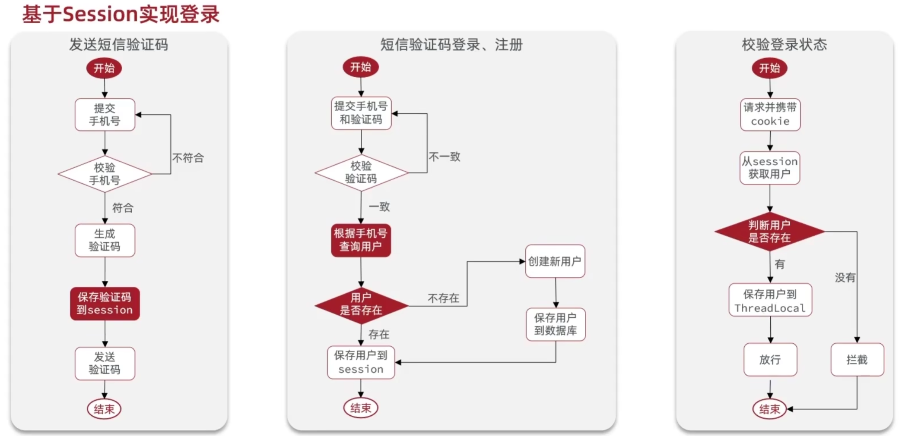

# 黑马点评

项目中 `Redis` 用途

1. 代替 `Session` ，解决集群共享问题（数据共享，内存存储，键值对存储）

## 一、基于 Session 与 Redis 的短信登录

### 1.1 发送短信验证码

`controller/UserController.sendCode` -> `service/impl/UserServiceImpl.sendCode`

课程的问题： 黑马没有将电话号码保存，可能会导致用户使用一个号码接受验证码，使用另一个号码登录

### 1.2 短信验证码登录与注册

`controller/UserController.login` -> `service/impl/UserServiceImpl.login`

`UserServiceImpl.login` 中用到的 `com.baomidou.mybatisplus.extension.service.IService.query`
与 `UserServiceImpl.signUp` 中用到的 `com.baomidou.mybatisplus.extension.service.IService.save`
都是 `MyBatis` 的功能，可以帮助我们更方便地使用数据库

### 1.3 登录校验

`com.hmdp.utils.LoginInterceptor`

继承自`org.springframework.web.servlet.HandlerInterceptor`，主要实现三个方法：

 - `preHandle` `Controller` 执行之前
 - `postHandle` `Controller` 执行之后
 - `afterCompletion` 视图渲染之后，返回之前

使用拦截器拦截用户请求进行登录校验，并将用户信息保存到 `ThreadLocal` 中方便后续使用。

为了使拦截器生效，我们还需要配置拦截器：

`com.hmdp.config.MVCConfig` 注册拦截器并排除不需要进行用户验证的功能。

`com.hmdp.controller.UserController.me` 就可以从 `Session` 中获取用户信息（`UserDTO`）并返回

### 1.4 Session 的集群共享问题

`Session` 是单个 `Tomcat` 服务器独有的内存空间，当我们不同的请求被 `Nginx` 分流到不同的 `Tomcat` 中时，
不同的 `Tomcat` 服务器不能共享 `Session` 资源，导致需要用户重复登录等异常行为。因此我们需要一个代替方案，
这个方案需要满足：数据共享，内存存储，键值对存储的特点。

因此可以使用 `Redis` 代替 `Session` 解决这个问题

### 1.5 基于 Redis 实现共享 Session 登录

