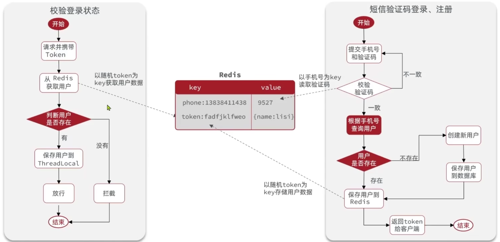
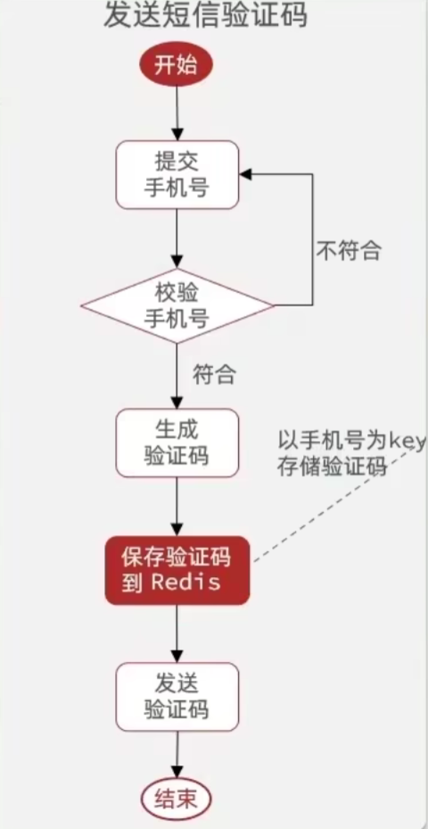
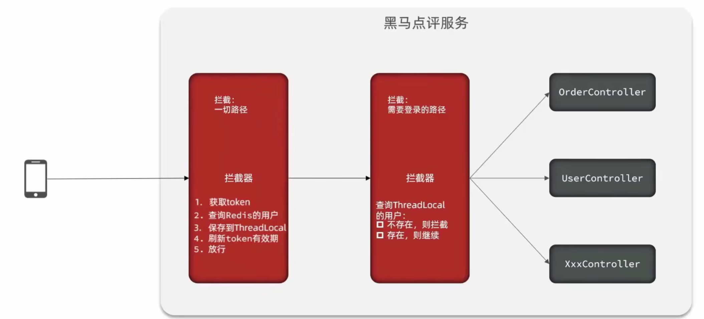
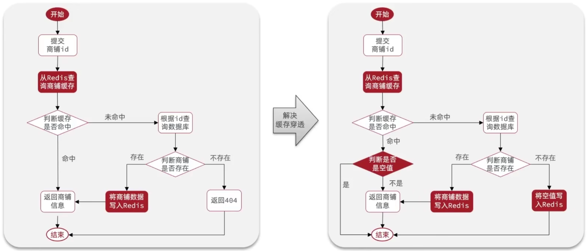
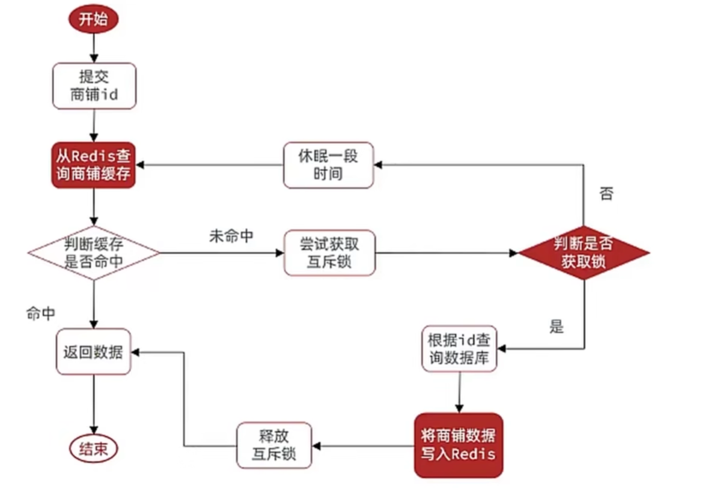
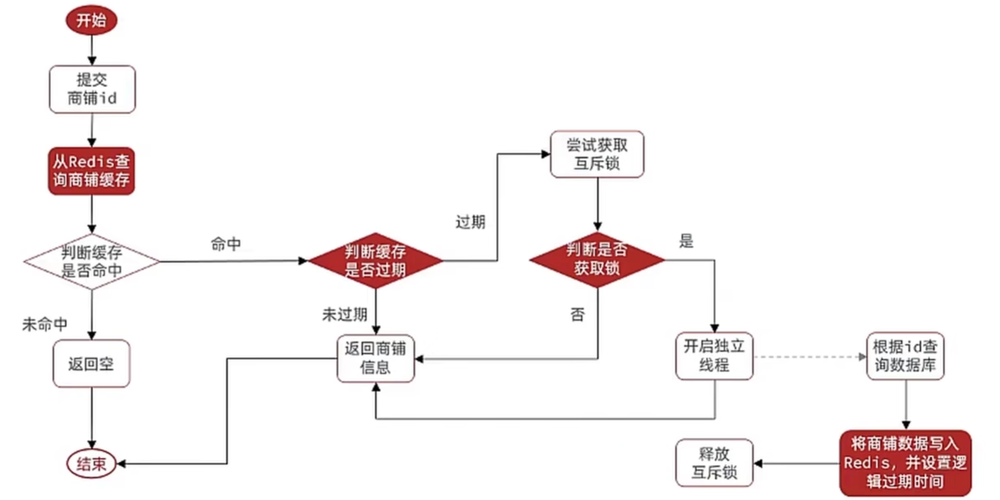
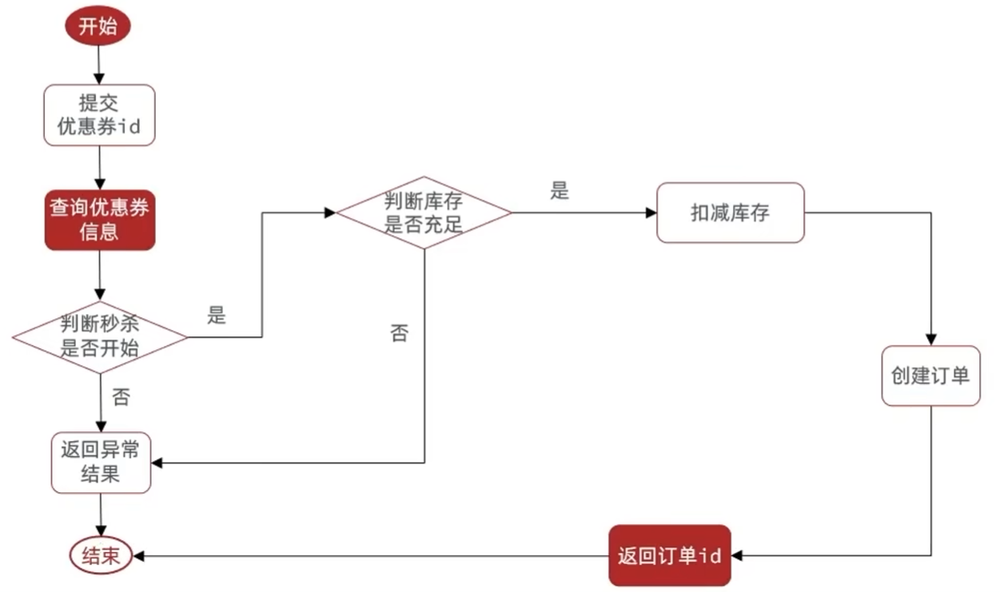
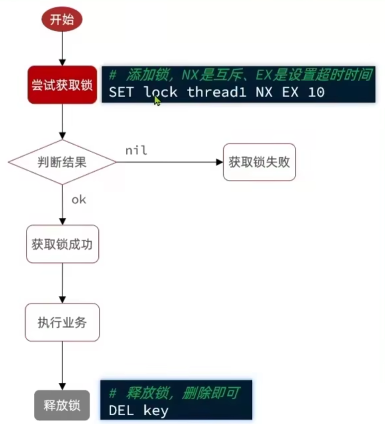
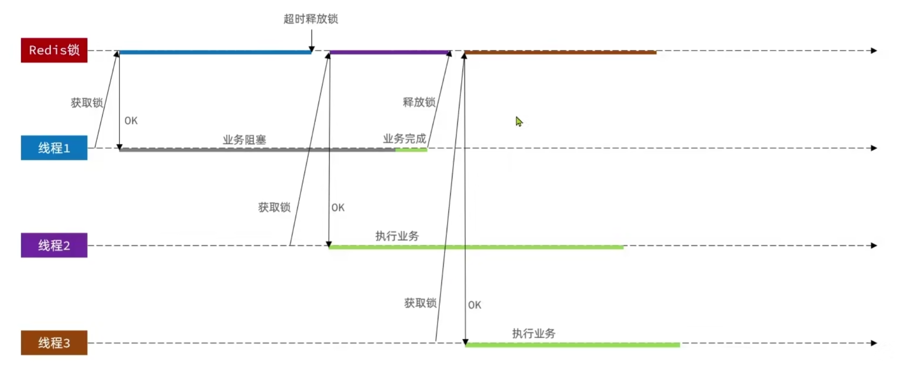
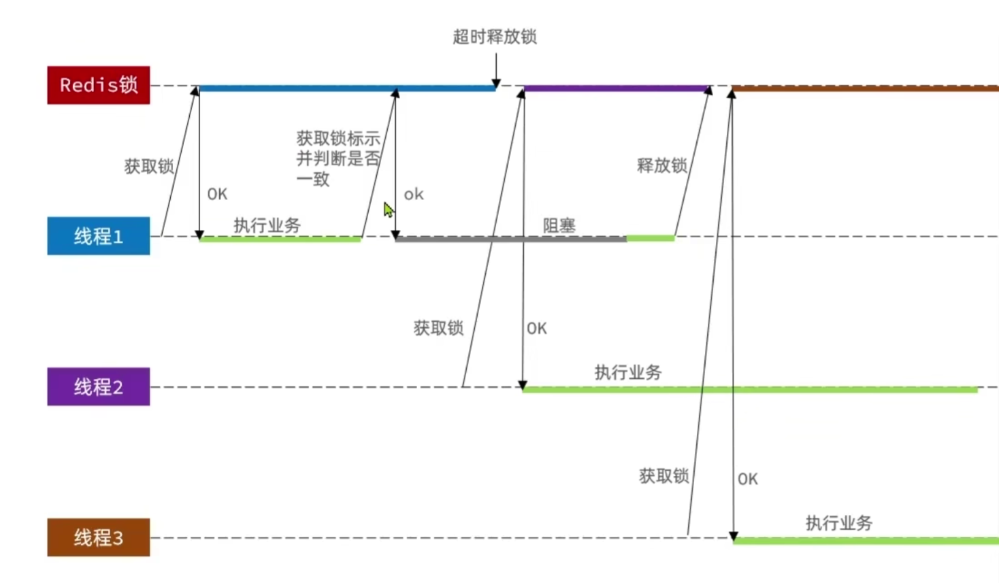

# 黑马点评

## 项目中 `Redis` 用途

1. 代替 `Session` ，解决集群共享问题（数据共享，内存存储，键值对存储）
   - 选择合适的数据结构（String、Hash 等）
   - 选择合适的 key（电话号码，token）
   - 设置合适的过期时间（如验证码设置为5分钟）
   - 选择合适的存储粒度（只保存业务需要的信息）
2. 作为缓存加速服务的运行
3. 使用 Redis 实现互斥锁
4. 使用 Redis 实现分布式锁
   - 多进程可见（包括集群模式）
   - 互斥
   - 高可用
   - 高性能（高并发）
   - 安全性

## 一、基于 Session 与 Redis 的短信登录


### 1.1 发送短信验证码

`controller/UserController.sendCode` -> `service/impl/UserServiceImpl.sendCode`

课程的问题：黑马没有将电话号码保存，可能会导致用户使用一个号码接受验证码，使用另一个号码登录

### 1.2 短信验证码登录与注册

`controller/UserController.login` -> `service/impl/UserServiceImpl.login`

`UserServiceImpl.login` 中用到的 `com.baomidou.mybatisplus.extension.service.IService.query`
与 `UserServiceImpl.signUp` 中用到的 `com.baomidou.mybatisplus.extension.service.IService.save`
都是 `MyBatis` 的功能，可以帮助我们更方便地使用数据库

### 1.3 登录校验

`com.hmdp.utils.LoginInterceptor`

继承自`org.springframework.web.servlet.HandlerInterceptor`，主要实现三个方法：

 - `preHandle` `Controller` 执行之前
 - `postHandle` `Controller` 执行之后
 - `afterCompletion` 视图渲染之后，返回之前

使用拦截器拦截用户请求进行登录校验，并将用户信息保存到 `ThreadLocal` 中方便后续使用。

为了使拦截器生效，我们还需要配置拦截器：

`com.hmdp.config.MVCConfig` 注册拦截器并排除不需要进行用户验证的功能。

`com.hmdp.controller.UserController.me` 就可以从 `Session` 中获取用户信息（`UserDTO`）并返回

### 1.4 Session 的集群共享问题

`Session` 是单个 `Tomcat` 服务器独有的内存空间，当我们不同的请求被 `Nginx` 分流到不同的 `Tomcat` 中时，
不同的 `Tomcat` 服务器不能共享 `Session` 资源，导致需要用户重复登录等异常行为。因此我们需要一个代替方案，
这个方案需要满足：数据共享，内存存储，键值对存储的特点。

因此可以使用 `Redis` 代替 `Session` 解决这个问题

### 1.5 基于 Redis 实现共享 Session 登录



由于 `Session` 是每个浏览器发送请求时独有的，不会互相干扰，而 `Redis` 将所有的浏览器的信息都保存在同一个 `Redis` 服务器中，
因此需要谨慎选择 `key` ，如进行验证码操作时 `code` 不可以作为一个 `key` ，因为不能区分这个验证码对应的是哪个用户。
保存用户信息时我们可以使用随机的 `token` （不用手机号码，满足安全性），使用 `hash` 结构来存储用户信息（也是 `k-v` 结构）。

#### 1.5.1 修改发送短信验证码流程

`com.hmdp.service.impl.UserServiceImpl.sendCode`



我们不把验证码 `code` 保存到 `Session` 中，而是保存到 `Redis` 中。

    stringRedisTemplate.opsForValue().set(LOGIN_CODE_KEY+phone, code, LOGIN_CODE_TTL, TimeUnit.MINUTES);

其中 `LOGIN_CODE_KEY` 和 `LOGIN_CODE_TTL` 来自 `com.hmdp.utils.RedisConstant`。

#### 1.5.2 修改短信验证码登录与注册

`com.hmdp.service.impl.UserServiceImpl.login`

方法同上。

我们将过期时间设置为用户不操作的30分钟以后，因此需要在拦截器中实时更新过期时间。

`com.hmdp.utils.LoginInterceptor`

注意，`com.hmdp.utils.LoginInterceptor` 没有添加 `Spring` 注解，因此不受 `Spring` 控制，因此我们不可以使用 `@Resource` 或者
`@Autowired` 之类的注解注入 `SpringRedisTemplate`。我们需要创建构造函数并且传入 `SpringRedisTemplate`。由于我们在
`com.hmdp.config.MVCConfig`中使用该拦截器，而 `com.hmdp.config.MVCConfig` 是一个 `Spring` 管理的类，因此可以在
`com.hmdp.config.MVCConfig` 中注入。

### 1.6 登录拦截器优化

由于现有的拦截器只对需要登录才能访问的页面进行拦截，因此如果用户一直访问无需登陆就可以查看的页面，也会导致登录失效。因此我们可以再增加一个拦截器，
拦截所有的请求，防止登录失效。



`com.hmdp.utils.RefreshTokenInterceptor` 用于刷新 token

`com.hmdp.utils.LoginInterceptor` 用于拦截未登录用户

## 二、商户查询缓存

### 2.1 Redis 缓存

为 `com.hmdp.controller.ShopController.queryShopById` `com.hmdp.controller.ShopTypeController.queryTypeList`
添加 Redis 缓存。

### 2.2 Redis 缓存更新

为了解决商铺缓存与数据库一致性问题，我们首先可以添加查询商铺的缓存失效时间。
（`com.hmdp.service.impl.ShopServiceImpl.queryById`）

接下来是更新业务，`com.hmdp.controller.ShopController.updateShop`
其实就是两步，先更新数据库，然后删除缓存（为什么不能先删除缓存然后更新数据库？因为删除缓存，如果数据库更新操作还没有完成就有查询请求，
会返回未更新的信息并写入缓存，该缓存失效前缓存与数据库不一致）。

### 2.3 缓存穿透

请求无效 key 导致 Redis 中无法找到该 key，访问数据库。

- 缓存空对象

`com.hmdp.service.impl.ShopServiceImpl.queryById`



- 布隆过滤器

使用哈希计算数据库中所有信息，并按哈希位保存在过滤器中。当收到请求时计算请求哈希，如果命中了布隆过滤器中没有的位则直接返回，
如果命中了已有的位则放行。因此布隆过滤器不能完全过滤缓存穿透请求。

### 2.4 缓存雪崩

短时间内大量缓存失效或者 Redis 宕机，导致大量请求同时到达数据库。

- Redis TTL 增加随机值
- 使用Redis 集群

### 2.5 缓存击穿

热点 key 过期导致大量热点请求命中数据库。

#### 2.5.1 互斥锁

缓存重建时使用互斥锁，防止大量的请求同时访问数据库进行缓存重建。



`com.hmdp.service.impl.ShopServiceImpl.tryLock` `com.hmdp.service.impl.ShopServiceImpl.unlock`
自定义锁的获取与释放
锁通过 Redis 实现

`com.hmdp.service.impl.ShopServiceImpl.queryShopByIdWithMutex` 实现互斥锁解决缓存穿透的问题并移动到
`com.hmdp.service.impl.ShopServiceImpl.queryShopById`。原方法内注释保留了原实现。

#### 2.5.2 逻辑过期

不设置过期时间，在字段中加入一个逻辑过期时间，当请求该数据时已经到达逻辑过期时间，开新线程进行更新，而该线程直接返回旧数据。
`com.hmdp.service.impl.ShopServiceImpl.queryShopByIdWithExpire`



## 2.6 Redis 工具类

`com.hmdp.utils.CacheClient`

- 将任意 java 对象转化为 json 并存储在 String 类型的 key 中，并设置过期时间 TTL
- 将任意 java 对象转化为 json 并存储在 String 类型的 key 中，并设置逻辑过期时间
- 根据指定的 key 查询缓存，并反序列化为具体类型，利用缓存空值的方式防止缓存击穿
- 根据指定的 key 查询缓存，并反序列化为具体类型，利用逻辑过期时间防止缓存击穿

## 三、优惠券秒杀

### 3.1 全局唯一 ID

订单 ID 不可以重复，也不可以使用自增长 ID（容易暴露信息），因此要使用全局唯一 ID。本次我们使用 redis 的自增实现。
也可以使用雪花算法（UUID）。

一种可能的 ID 结构为：1位符号位（0，表示正数），31位时间戳（以秒为单位），32位序列号共64位（8个字节）。

`com.hmdp.utils.RedisIDGenerator`

### 3.2 添加优惠券

`com.hmdp.controller.VoucherController`

### 3.3 秒杀下单

`com.hmdp.controller.VoucherOrderController.seckillVoucher`



### 3.4 超卖问题

高并发状态下，查询库存后可能不能在下一个查询开始前卖出库存，导致超卖。
我们可以加锁来解决这个问题。

悲观锁认为线程安全问题大概率会发生，因此先加锁再获取资源。
乐观锁认为线程安全问题很难发生，因此不加锁，只在写数据时判断数据是否被修改。

因此我们可以使用乐观锁。

乐观锁：版本号法，CAS 法

CAS 法在本项目中的使用很简单，在修改数据库时添加判断数据库当前值与判断库存是否充足时的值是否相等就行了。

```Java
boolean success = seckillVoucherService.update()
        .setSql("stock = stock - 1")
        .eq("voucher_id", voucherId)
        .eq("stock", voucher.getStock())
        .update();
```

但是这种方法因为并发修改而失败时，并没有进行重试，因此返回 `false` 导致部分用户无法购买。
因此可以作出修改，当当前库存值大于0时就可以进行购买。

```Java
boolean success = seckillVoucherService.update()
        .setSql("stock = stock - 1")
        .eq("voucher_id", voucherId)
        .gt("stock", 0)
        .update();
```

现在该服务已经可以成功运行，但是是直接运行在 MySQL 中，因此性能并没有达到完美。

### 3.5 一人一单

修改业务，使每个用户只能下单一次。要注意多线程问题，可能导致一个用户短时间内下多单（加悲观锁，不能用乐观锁：
乐观锁用于修改，而下单操作涉及到新增）。

将需要加锁的部分抽象出来。
`com.hmdp.service.impl.VoucherOrderServiceImpl.createVoucherOrder`

当然还有一些细节问题，比如数据库的事务管理与加锁的位置：

```Java
synchronized (userId.toString().intern()) {
   // 获取当前代理对象
   IVoucherOrderService proxy = (IVoucherOrderService) AopContext.currentProxy();
   return proxy.createVoucherOrder(voucherId);
}
```

先获取当前的对象才可以确保事务可以进行（获取代理对象）。
要确保事务提交以后才可以释放锁。

### 3.6 分布式锁

以上的并发解决方案只能解决单机的并发安全问题。当我们部署了多台服务器后，由于一台服务器内部的互斥锁无法锁住其它服务器，
因此仍然会导致一个用户可以下单多次。

因此我们需要引入分布式锁解决问题。

`com.hmdp.utils.ILock` 分布式锁接口。

`com.hmdp.utils.SimpleRedisLock` 基于 Redis 实现的分布式锁，使用 `setnx` 实现。



然后就可以修改 3.5 中的锁的部分。

### 3.7 Redis 分布式锁误删问题

误删问题的原因



解决方法：释放锁时判断锁的标识（比如线程序号。
在集群模式下，每个 jvm 都会维护自己的线程标识，因此有概率导致线程标识冲突。因此可以考虑将线程标识换成 uuid 等）。

`com.hmdp.utils.SimpleRedisLock`

### 3.8 分布式锁的原子性问题



由于 Redis 的事务是一次性批处理得到的，无法获取中间过程，而且只能保证原子性，不能保证一致性。如果要强行使用 Redis 事务，
需要配合乐观锁等技术，较为繁琐，因此可以使用 Lua 脚本。

Lua 调用 Redis 是通过 `redis.call()` 函数进行的。

Redis 使用 `EVAL` 命令调用 Lua 脚本。

Java 中也可以调用 Lua 脚本。

`com.hmdp.utils.SimpleRedisLock.unlock`

### 3.9 分布式锁的优化

原有的分布式锁有一些问题，如不可重入（同一个线程无法多次获取同一把锁），不可重试（获取锁失败就直接返回 false ），超时释放
（如果任务执行时间较长可能导致锁失效），主从一致性（如主节点加锁后挂了，新主节点还没有同步原主节点的信息，则新主节点中没有锁信息）问题。

这些问题难以解决，因此我们可以使用 `Redisson` 这样的第三方分布式工具。

`com.hmdp.config.RedissonConfig` Redisson 配置

### 3.10 秒杀优化
